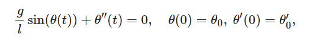
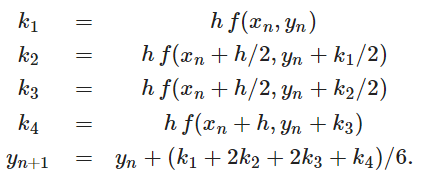
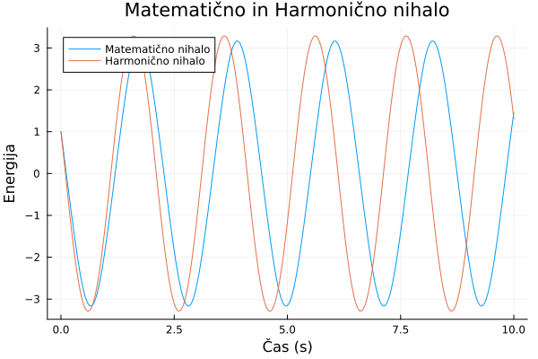
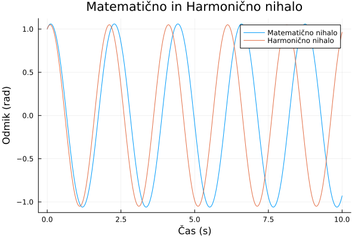

# 3. Domača naloga Matematično nihalo
Elian Mugerli, 7.9.2024

Naloga zahteva izpeljavo matematičnega nihala, kjer je treba poiskati kotni odmik theta(t) nihala pri nihanju brez dušenja. Nihanje je predstavljeno z naslednjo diferencialno enačbo drugega reda (spodaj).

kjer je `g = 9.80665m/s^2` težni pospešek in `l` dolžina nihala.

Enačbo nato prevedemo na sistem prvega reda in dobimo naslednje:

$\theta^{\prime}(t) = v(t)$

$v^{\prime}(t) = -\frac{g}{l} \sin(\theta(t))$

Dobljeni sistem diferencialnih enačb rešujemo s pomočjo Runge-Kutta metode četrtega reda.

V tem direktoriju se nahajajo datoteke potrebne za delovanje 2. domače naloge. Nalogo poženemo, tako da pokličemo `include("docs/demo.jl")`. V njem se nahaja rešitev za podani problem. Še pred tem je potrebno poklicati `activate Domaca03`. 

## Rešitev

Rešitev podanega problema je implementirano s pomočjo metod `runge_kutta4`, `nihalo`, `nihalo_extended`.

Metoda `nihalo` se uporablja za izračun kotnih odmikov podanega matematičnega nihala s pomočjo metore Runge-Kutta 4.stopnje.

Metoda `nihalo_extended` je le nadgradnja predhodne metode in poleg kotnih odmikov izračunava tudi hitrosti podanega nihala. Prav tako pa njen klic zahteva dodaten parameter `tip_nihala`, ki lahko glede na izbrano nihalo (matematično/harmonično) prilagaja funkcijo hitrosti.

## Testi

Za podani problem testi žal niso bili implementirani.

## Dokumentacija

Poročilo generiramo s paketom [Weave.jl](https://github.com/JunoLab/Weave.jl). Podrobnosti so v datoteki `makedocs.jl`.

Zgornja ukaza iz komentarjev in kode v `demo.jl` generirata PDF datoteko, ki se ob generiranju nahaja znotraj direktorija `build` v datoteki `demo.pdf`.